# CKAD Note Section 8 State Persistence

<br>

## 105. Volumes

<br>

### hostPath

<br>

這個範例 mount worker-node 的 `/data` 進 `pod` 裡面，並且 mapping 到 container 裡面的 `/test-pd`。\
實際上我們並不會這樣做，因為 worker-node 之間的資料並沒辦法同步，一般來說會使用 shared storage 例如: NFS, ClusterFS, Ceph, AWS EBS, AzureDisk ....

<br>

```yaml
apiVersion: v1
kind: Pod
metadata:
  name: test-pd
spec:
  containers:
  - image: k8s.gcr.io/test-webserver
    name: test-container
    volumeMounts:
    - mountPath: /test-pd
      name: test-volume
  volumes:
  - name: test-volume
    hostPath:
      # directory location on host
      path: /data
      # this field is optional
      type: Directory
```

<br>

## 106. Persistent Volumes

<br>

Persistent Volumes 將 Storage (Disk) 抽象化，供上層 PVC (Persistent Volume Claim) 使用。並且擁有自己的 lifecycle (`pv.spec.persistentVolumeReclaimPolicy`)

<br>

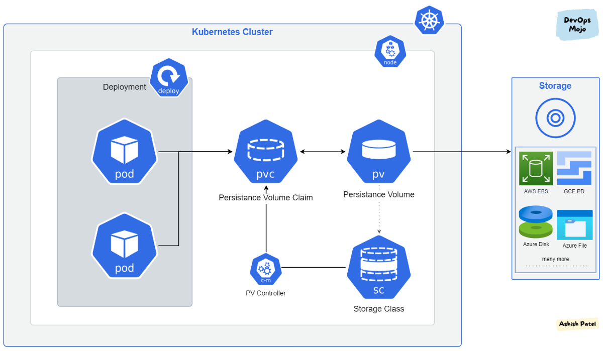

▲ Persistent Volume 與 PVC 關係示意圖。 [圖片來源](https://medium.com/devops-mojo/kubernetes-storage-options-overview-persistent-volumes-pv-claims-pvc-and-storageclass-sc-k8s-storage-df71ca0fccc3)

<br>

```yaml
apiVersion: v1
kind: PersistentVolume
metadata:
  name: pv-vol1
spec:
  capacity:
    storage: 1Gi
  accessModes:
    - ReadWriteOnce
  hostPath:
    path: /tmp/data
```


一樣要再講一次， **hostPath 測試環境 Only (local filesystem)**

<br>

```bash
kubectl apply -f pv.yml
kubectl get persistentvolume
```

<br>

## 107. Persistent Volume Claims

<br>

- **<span style='color:red'>Persistent Volume 與 Persistent Volume Claim 是 1:1 的關係。</span>**
- PV 與 PVC 在 Kubernetes namespace 當中是不同的物件。
- PVC 透過 YAML 定義的 `Sufficient Capacity`, `Access Modes`, `Volume Modes`, `Storage Class` 去尋找合適的 PV 對應 (配對成功!)。
- (承上) 或者增加 `selector` 直接給定指定 PV。


<br>

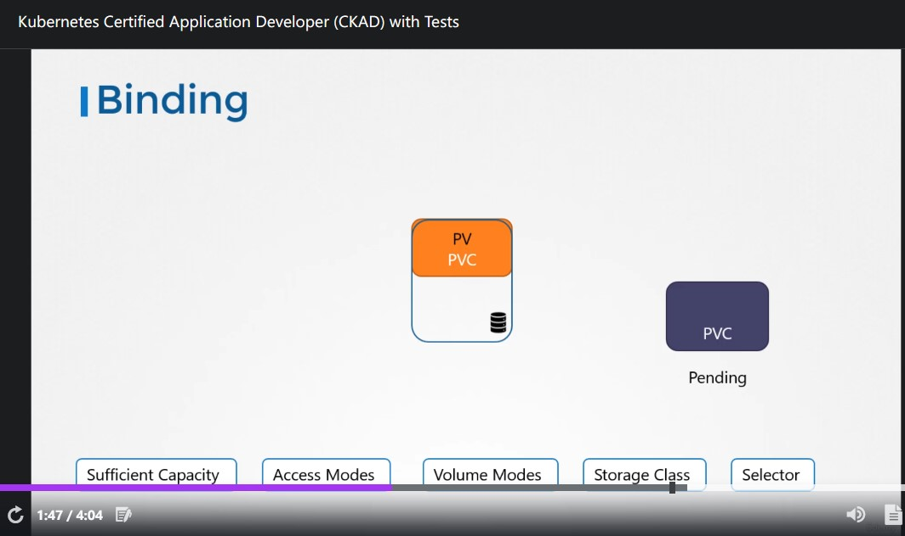

▲ 可能的情形就是 PVC matching 到的 PV 比 PVC 定義所需的空間還大，**<span style='color:red'>由於 1:1 的關係，剩餘的空間沒辦法給其它 PVC 使用</span>**

<br>

```yaml
apiVersion: v1
kind: PersistentVolumeClaim
metadata:
  name: myclaim
spec:
  accessModes:
    - ReadWriteOnce
  resources:
    requests:
      storage: 500Mi
```

<br>

```bash
kubectl apply -f pvc.yml
kubectl get persistentvolumeclaims
```

<br>

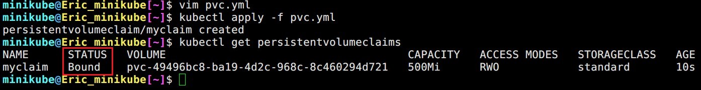

▲ 驗證即使沒有使用 `selector` ，條件配對成功還是可以的 (`STATUS == Bound`)

<br>

`pv.spec.persistentVolumeReclaimPolicy` 定義當 PV 不被 PVC 使用時，該怎麼被處理。


```yaml
apiVersion: v1
kind: PersistentVolume
metadata:
  name: pv0003
spec:
  capacity:
    storage: 5Gi
  volumeMode: Filesystem
  accessModes:
    - ReadWriteOnce
  persistentVolumeReclaimPolicy: Recycle
  storageClassName: slow
  mountOptions:
    - hard
    - nfsvers=4.1
  nfs:
    path: /tmp
    server: 172.17.0.2
```

<br>

- (Default) Retain: 除非被 Administrator 刪除，不然保留 **<span style='color:red'>而且不被其它 PVC 使用</span>**。
- 【Deprecated】Recycle: 刪除 PV 底下的資料 (`rm -rf /thevolume/*`) **<span style='color:blue'>可以被其它 PVC 使用</span>**。
- Delete: 直接刪除 PV。


recycle 已被 deprecated 的 Announcement: [Re: Persistent Volume Recycler Deprecation Annoucement](https://groups.google.com/g/kubernetes-dev/c/uexugCza84I)

<br>

PVC 宣告完之後 `pod` 或者其它 K8s Object 要怎麼使用呢? 這邊有範例:


```yaml
    apiVersion: v1
    kind: Pod
    metadata:
      name: mypod
    spec:
      containers:
        - name: myfrontend
          image: nginx
          volumeMounts:
          - mountPath: "/var/www/html"
            name: mypd
      volumes:
        - name: mypd
          persistentVolumeClaim:
            claimName: myclaim
```

<br>

---

## (CKAD 不考) 112. Storage Classes

<br>

每次創 PVC 之前都要先創建 PV 很煩、很不自動，怎麼辦 ? **<span style='color:red'>Storage Classes</span>** 可以讓你在建立 PVC 時順便幫你建好 PV~\
vSphere, ProxmoxVE 的 provisor 都有內建在 K8s 裡面!!

<br>

```yaml
apiVersion: storage.k8s.io/v1
kind: StorageClass
metadata:
  name: vsphere
provisioner: kubernetes.io/vsphere-volume
parameters:
  diskformat: zeroedthick
```

▲ vSphere 的 `Storage Class`

<br>

```yaml
apiVersion: v1
kind: PersistentVolumeClaim
metadata:
  name: my-vsphere-claim
spec:
  accessModes:
    - ReadWriteOnce
  resources:
    requests:
      storage: 8Gi
  storageClassName: vsphere
```

▲ 在建立 PVC 的時候加入 `storageClassName: vsphere` 就可以使用囉!

<br>

## (CKAD 不考) 114. Why Stateful Sets?

<br>

作者用 MySQL DB 做 HA 架構來解釋為什麼需要 `StatefulSet`，總共三台 instance (master and two slaves) 分別有這些要求:


1. Setup master first and then slaves. (第一個被 部屬/設定 的必須是 master，接著 slave)
2. Clone data from master to `slave-1`. (`slave-1` 必須從 master 拉資料)
3. Enable continouous replication from master to `slave-1`. (持續從 master sync data 到 slave)
4. Wait for `slave-1` to be ready. (等待 `slave-1` 準備好可以被使用)
5. Clone data from `slave-1` to `slave-2`. (為了避免造成 master 網路上的負擔，`slave-2` 必須先從 `slave-1` 拉資料)
6. Enable continouous replication from master to `slave-2`. (持續從 master sync data 到 slave)
7. Configure master node address on slave. (因為 sync 必須知道誰是 master)

<br>

### Deployment


- `Deployment` 裡面的 `pod` 沒辦法保證順序，也因此無法定義 Master。
- Slaves 無法透過 IP address 或者 hostname, DNS domain name 去找 master 做 sync；反之亦然。 (`pod` name 有隨機產生的部分，Evernote 筆記有: `kubernetes (k8s) Deployment 是直接納管 pods 嗎? 還是透過 replica set (rs)`)

<br>

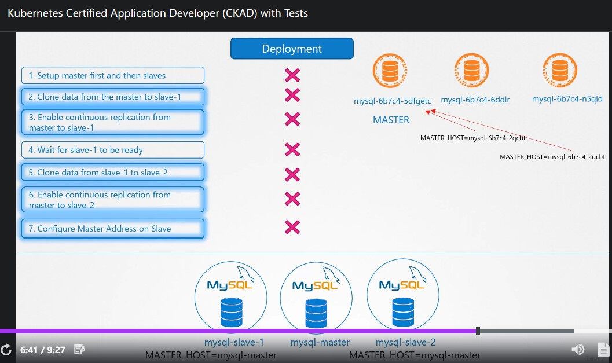

▲ `Deployment` 做不到上述要求，宣告失敗!

<br>

### Stateful Sets


- `pod` 會被依序建立。
- `StatefulSet` 會指定有序的 index 給每一個 `pod`


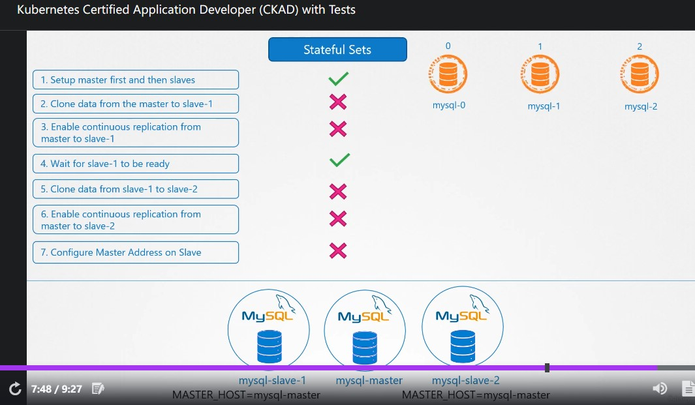

▲ 每個 `pod` 都掛依序掛編號，解決 `pod` name 有隨機產生的部分問題。即使 `pod` 被 re-create 名稱也不會跑掉~

<br>

## (CKAD 不考) 115. Stateful Sets Introduction

<br>

`StatefulSet` (<span style='color:red'>開頭兩個 `S` 都是大寫</span>) 與 `Deployment` 87% 像~\
`.spec.serviceName` 的部分是搭配 `Headless service` (後面會提到) 


```yaml
apiVersion: apps/v1
kind: StatefulSet
metadata:
  name: web
spec:
  selector:
    matchLabels:
      app: nginx # has to match .spec.template.metadata.labels
  serviceName: "nginx"
  replicas: 3 # by default is 1
  template:
    metadata:
      labels:
        app: nginx # has to match .spec.selector.matchLabels
    spec:
      containers:
      - name: nginx
        image: k8s.gcr.io/nginx-slim:0.8
        ports:
        - containerPort: 80
          name: web
```

<br>

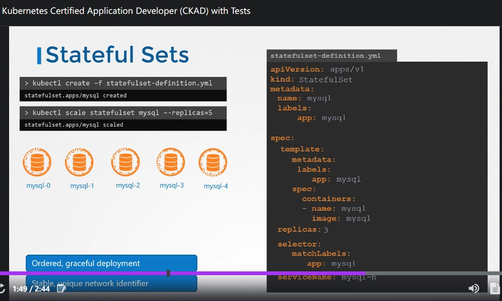

▲ `kubectl scale statefulset mysql --replicas=5` 也會依序增加，並給予獨特 `pod` name；down scale 反之亦然

<br>

如果你只想享受 `StatefulSet` 帶來指定、獨一無二 的 `pod` name **<span style='color:red'>而不想讓它按照順序 scale up/down `pod` 時 (包含第一次產生)</span>**\
可以設定 `.spec.podManagementPolicy == Parallel` 詳細參考 [Pod Management Policies](https://kubernetes.io/docs/concepts/workloads/controllers/statefulset/#pod-management-policies)

<br>

## (CKAD 不考) 116. Headless Services

<br>

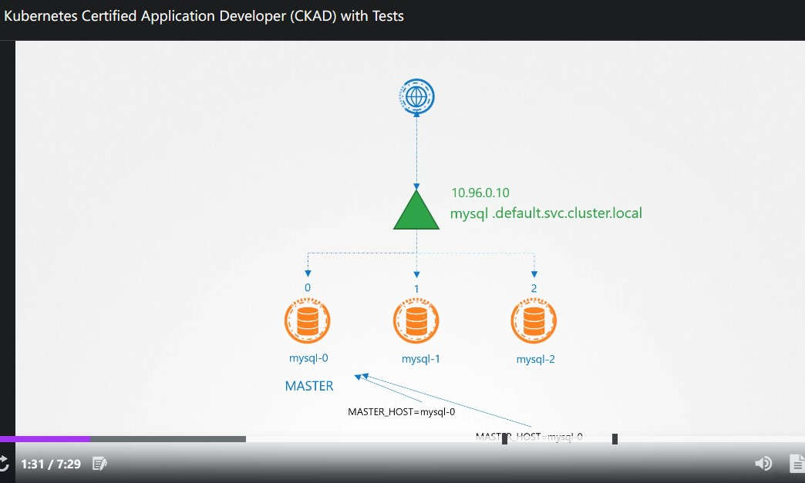

▲ 一般的 `service` 長這樣。其它位於 K8s cluster 內的 app 可以透過 `mysql-default.svc.cluster.local` 訪問 MySQL。

<br>

還記得這是 MySQL 服務嗎? **<span style='color:red'>Master 可以 R/W 沒問題，但是 Slaves 只能 R</span>** 

<br>

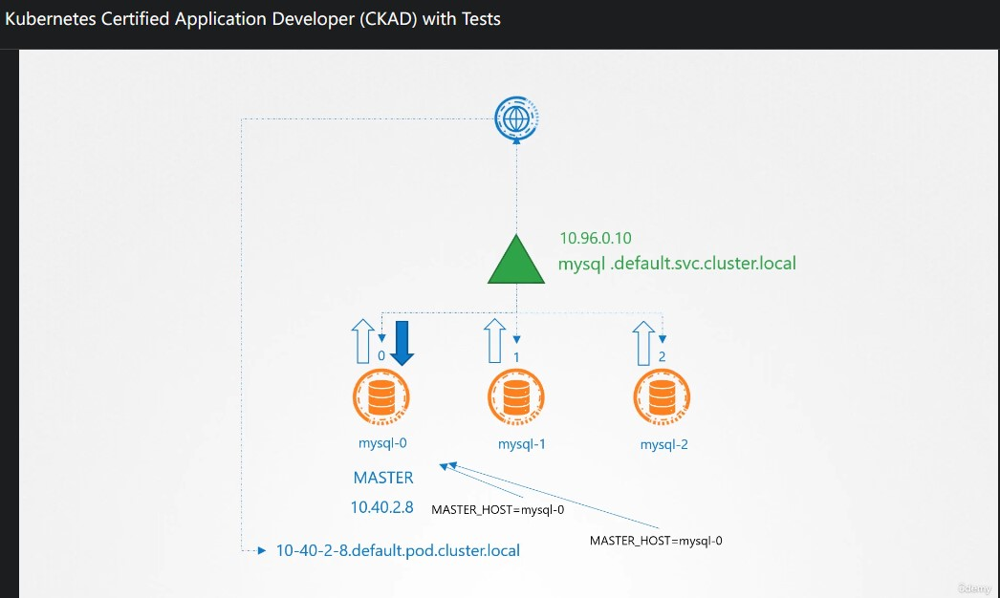

▲ `Deployment` 內，每個 `pod` 的 IP Address 的 DNS A record 長這樣: `10-40-2-8.default.pod.cluster.local` **<span style='color:red'>不過 IP Address 是變動的<span>**

<br>

這時候就需要 `Headless service` 了!


- `Headless service` 不做 Load Blance，只幫每一個 `pod` 按照順序創造獨一無二的 DNS domain name。
- 格式如下: `<pod_name>.<headless_service_name>.<namespace>.<svc>.<cluster_domain>`。

<br>

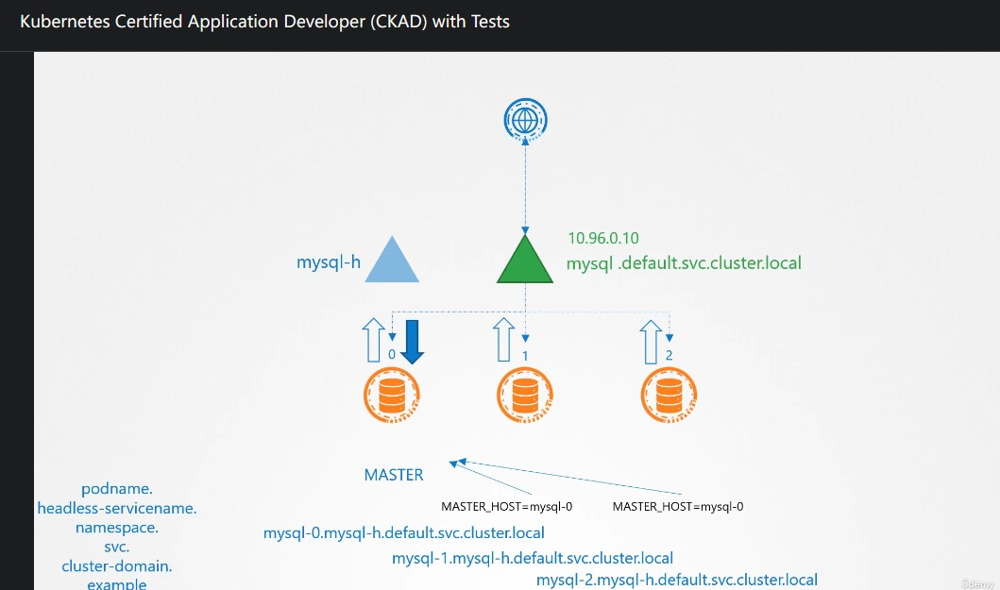

▲ 各個 `pod` 的 DNS domain name 如上~

<br>

**<span style='color:blue'>`Headless service` 與一般 `service` 的差異只在於 `.spec.clusterIP == Node`</span>**

<br>

```yaml
apiVersion: v1
kind: Service
metadata:
  name: nginx
  labels:
    app: nginx
spec:
  ports:
  - port: 80
    name: web
  clusterIP: None
  selector:
    app: nginx
```

<br>

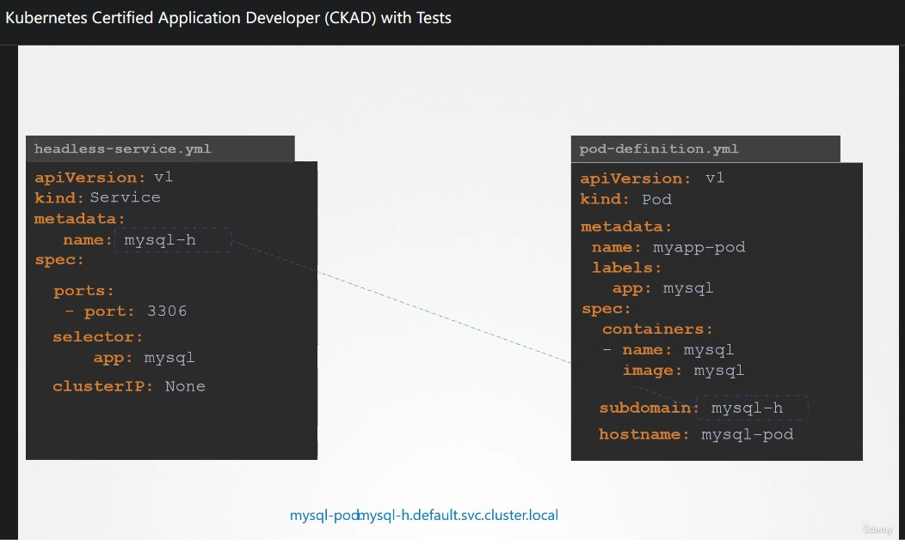

▲ 如果是使用 `pod` 搭配 `Headless service` 的話必須加 `.spec.subdomain`, `.spec.hostname`

<br>

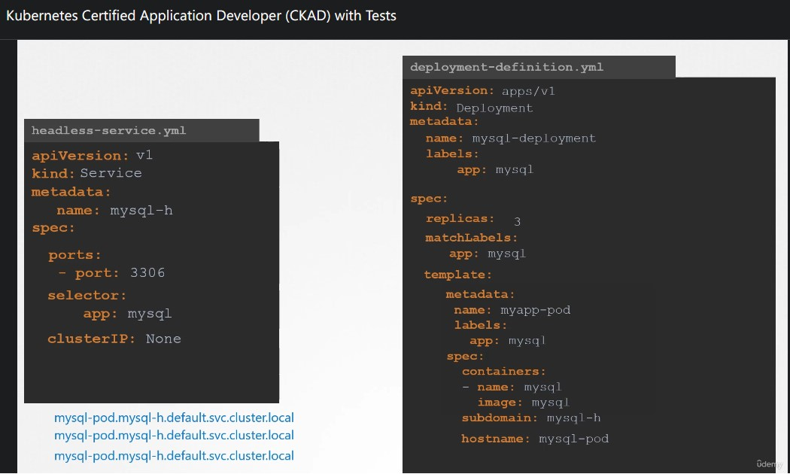

▲ 如果我們在 `Deployment` 當中給定 `.spec.template.spec.hostname` 的話，整個 DNS A record 都會一樣 (左下角)。\
**<span style='color:blue'>這也是改用 `StatefulSet` 的好處之一，我們不需要去定義 `.spec.subdomain`, `.spec.hostname`，而是透過 `.spec.serviceName` 去連結 `Headless servie`</span>**

<br>

## (CKAD 不考) 117. Storage in StatefulSets

<br>

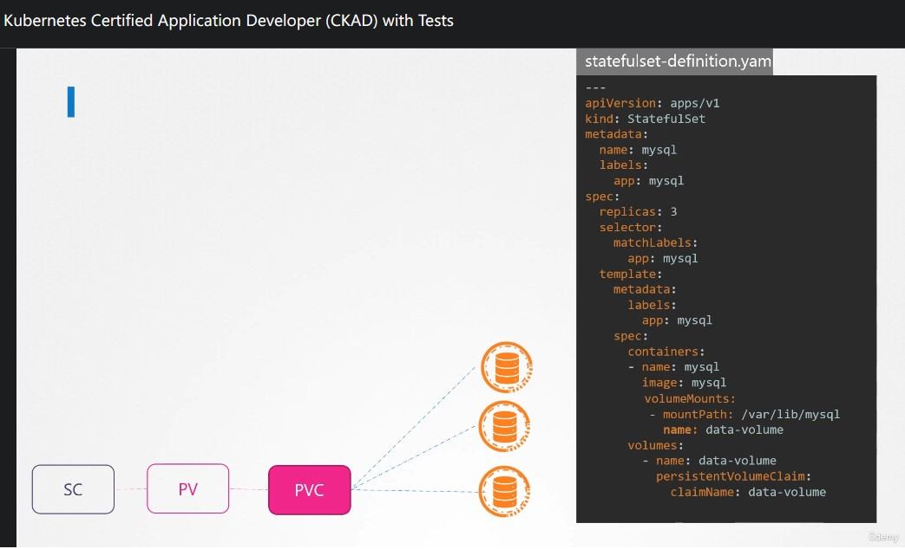

▲ 在 `StatefulSet` 沒有使用 `.spec.volumeClaimTemplates` 的話，三個 MySQL `pod` 都會共用同一個 `PVC`。

<br>

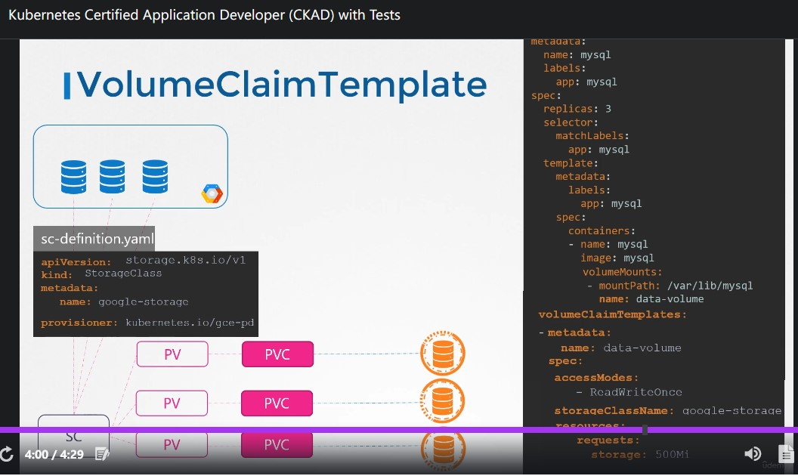

▲ 用上 `.spec.volumeClaimTemplates` 就會長這樣，其中 `.spec.volumeClaimTemplates` 的內容就是 `PVC` 啦~\
**<span style='color:red'>不過當 `pod` 因為某些原因被 re-create 的話，它將延續使用舊有 `PVC`</span>**

<br>

### 問問筆記


大家好，我想請問一個關於 `StatefulSet` 使用 `.spec.volumeClaimTemplates` 的問題:

以這個範例來說會產生三個 `pod` (假設叫做 `pod{1..3}`)，當 `pod1` 因為某些原因被 re created 了，它將延續使用舊有的 PVC。
如果我不想呢? 想給 `pod1` 全新的一個 PVC
請問有什麼做法呢?
如果在 PVC `.spec.persistentVolumeReclaimPolicy` 設定 Recycle/Delete 是不是可行? 謝謝


範例: https://kubernetes.io/docs/concepts/workloads/controllers/statefulset/#components


**<span style='color:red'>Ans:</span>**


不行，Policy 定義的是當 PVC 消失後 PV 被怎麼處理。而且這個需求與 `StatefulSet` 反其道而行。\
[Hiskio-Kubernetes](https://t.me/hiskio_k8s/7000)

<br>