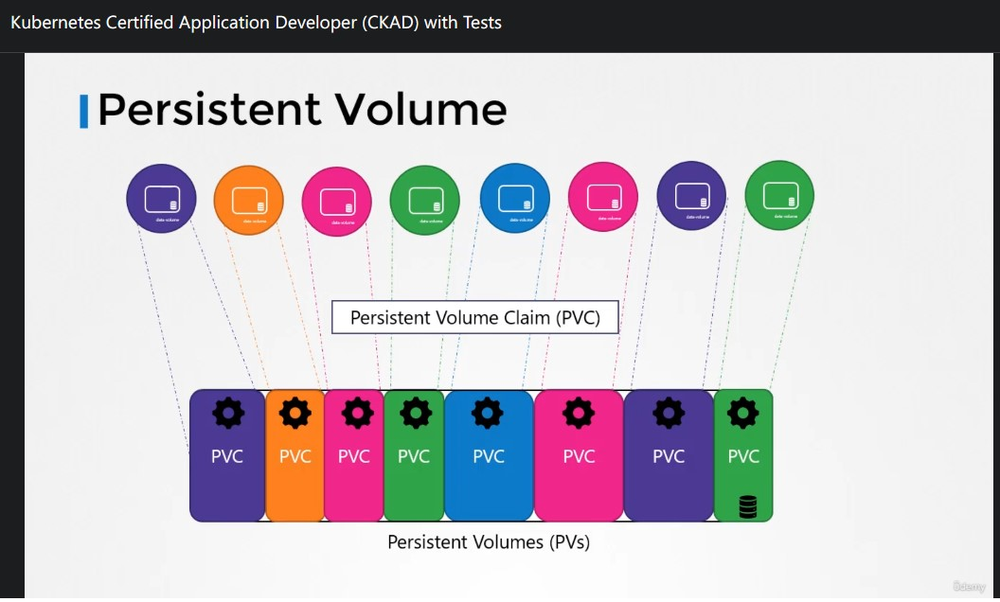

# CKAD Note Section 8 State Persistence

<br>

## 105. Volumes

<br>

### hostPath

<br>

這個範例 mount worker-node 的 `/data` 進 `pod` 裡面，並且 mapping 到 container 裡面的 `/test-pd`。\
實際上我們並不會這樣做，因為 worker-node 之間的資料並沒辦法同步，一般來說會使用 shared storage 例如: NFS, ClusterFS, Ceph, AWS EBS, AzureDisk ....

<br>

```yaml
apiVersion: v1
kind: Pod
metadata:
  name: test-pd
spec:
  containers:
  - image: k8s.gcr.io/test-webserver
    name: test-container
    volumeMounts:
    - mountPath: /test-pd
      name: test-volume
  volumes:
  - name: test-volume
    hostPath:
      # directory location on host
      path: /data
      # this field is optional
      type: Directory
```

<br>

## 106. Persistent Volumes

<br>

Persistent Volumes 可以把它當作是一塊 shared storge，而 Persistent Volume Claims 則是有點像從 PV 宣告一塊儲存空間可以供 K8s Object 使用。

<br>



▲ Persistent Volume 與 PVC 關係示意圖

<br>

```yaml
apiVersion: v1
kind: PersistentVolume
metadata:
  name: pv-vol1
spec:
  capacity:
    storage: 1Gi
  accessModes:
    - ReadWriteOnce
  hostPath:
    path: /tmp/data
```


一樣要再講一次， **hostPath 測試環境 Only (local filesystem)**

<br>

```bash
kubectl apply -f pv.yml
kubectl get persistentvolume
```

<br>

## 107. Persistent Volume Claims

<br>

- **<span style='color:red'>Persistent Volume 與 Persistent Volume Claim 是 1:1 的關係。</span>**
- PV 與 PVC 在 Kubernetes namespace 當中是不同的物件。
- PVC 透過 YAML 定義的 `Sufficient Capacity`, `Access Modes`, `Volume Modes`, `Storage Class` 去尋找合適的 PV 對應 (配對成功!)。
- (承上) 或者增加 `selector` 直接給定指定 PV。


<br>


▲ 可能的情形就是 PVC matching 到的 PV 比 PVC 定義所需的空間還大，**<span style='color:red'>由於 1:1 的關係，剩餘的空間沒辦法給其它 PVC 使用</span>**

<br>

```yaml
apiVersion: v1
kind: PersistentVolumeClaim
metadata:
  name: myclaim
spec:
  accessModes:
    - ReadWriteOnce
  resources:
    requests:
      storage: 500Mi
```

<br>

```bash
kubectl apply -f pvc.yml
kubectl get persistentvolumeclaims
```

<br>


▲ 驗證即使沒有使用 `selector` ，條件配對成功還是可以的 (`STATUS == Bound`)

<br>

可以在 PVC YAML 裡面定義，當 PVC 被刪除 PV 要怎麼被處裡


```yaml
apiVersion: v1
kind: PersistentVolumeClaim
metadata:
  name: myclaim
spec:
  accessModes:
    - ReadWriteOnce
  resources:
    requests:
      storage: 500Mi
  persistentVolumeReclaimPolicy: Retain
```

<br>

- (Default) Retain: 除非被 Administrator 刪除，不然保留 **<span style='color:red'>而且不被其它 PVC 使用</span>**。
- Recycle: 刪除 PV 底下的資料 (`rm -rf /thevolume/*`) **<span style='color:blue'>可以被其它 PVC 使用</span>**。
- Delete: 直接刪除 PV。

<br>

